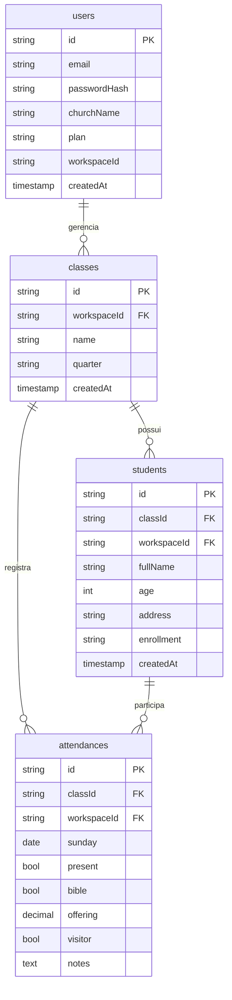

# DominiCad – Caderneta Digital SaaS

DominiCad é um aplicativo SaaS pensado para igrejas evangélicas digitalizarem a tradicional caderneta da Escola Dominical. O objetivo do projeto é oferecer uma base completa com landing page, telas internas, rotas de API e documentação para evoluir o produto rumo a produção.


> **Status**: interface e APIs mockadas para prototipagem. Ideal para validação de UX, definição de requisitos com a liderança e demonstrações para igrejas parceiras.

## ✨ Principais recursos

- Landing page institucional com chamada para cadastro, descrição de recursos e planos.
- Tela de autenticação com formulário unificado de login e registro.
- Dashboard com cartões de métricas, tabelas e gráficos em CSS para acompanhamento trimestral e anual.
- Caderneta digital interativa com CRUD local de presença, bíblia, ofertas, visitantes e resumo da aula.
- Rotas de API mockadas (Next.js Route Handlers) para usuários, turmas, alunos, presenças e métricas.
- Design responsivo inspirado na caderneta física, com identidade moderna em tons de esmeralda e ardósia.

## 🧱 Arquitetura da solução

| Camada          | Tecnologia                     | Observações |
|-----------------|--------------------------------|-------------|
| Front-end       | Next.js 15 (App Router) + React 19 | Componentização com Tailwind CSS 4 (classes utilitárias) e fontes Geist. |
| Autenticação    | Integração planejada com Firebase Auth ou Auth0 | Telas e rotas preparadas para emissão e validação de JWT. |
| Back-end / API  | Next.js Route Handlers         | Rotas em `src/app/api` retornam dados mockados para facilitar integração posterior. |
| Banco de dados  | MongoDB ou PostgreSQL          | Estrutura multi-tenant utilizando `workspaceId` para isolar dados por igreja. |

### Modelagem de dados sugerida



## 📂 Estrutura de pastas

```
src/
├── app/
│   ├── api/               # Rotas REST mockadas
│   ├── caderneta/         # Tela de registro semanal
│   ├── dashboard/         # Painel com métricas
│   ├── login/ e register/ # Fluxos de autenticação
│   └── page.tsx           # Landing page institucional
├── components/            # Componentes compartilhados
└── data/                  # Dados mockados para UI
```

## 🔐 Rotas de API disponíveis

| Método | Rota                        | Descrição |
|--------|-----------------------------|-----------|
| POST   | `/api/auth/register`        | Criação simulada de usuário/workspace. |
| POST   | `/api/auth/login`           | Retorna token JWT mockado e usuário. |
| GET/POST | `/api/classes`            | Lista ou cria turmas vinculadas ao workspace. |
| GET/POST | `/api/students`           | Lista ou cria alunos (filtro por `classId`). |
| GET/POST | `/api/attendances`        | Consulta e registra presenças semanais. |
| GET    | `/api/dashboard`            | Dados consolidados para cartões e gráficos. |

> Para uso em produção, substitua os mocks por integrações reais com banco de dados e provedores de autenticação.

## 🚀 Como executar localmente

```bash
npm install
npm run dev
```

O servidor será iniciado em [`http://localhost:3000`](http://localhost:3000). A aplicação é totalmente SSR/SPA-ready e pode ser publicada na Vercel (front-end) e Render/Heroku/Firebase Functions (back-end).

## 🛠 Próximos passos sugeridos

- Conectar as rotas de API a um banco real (MongoDB Atlas ou Supabase/PostgreSQL).
- Implementar autenticação real com Firebase Auth ou Auth0, armazenando o `workspaceId` no token.
- Criar camada de serviço para cálculos avançados (média de frequência, indicadores por trimestre/ano).
- Integrar biblioteca de gráficos (ex.: Recharts) para visualizações dinâmicas.
- Implementar autorização por perfil (pastor, superintendente, professor, secretário).

## 📄 Licença

Projeto entregue como base educacional e pode ser adaptado livremente pela sua igreja ou equipe de desenvolvimento.
