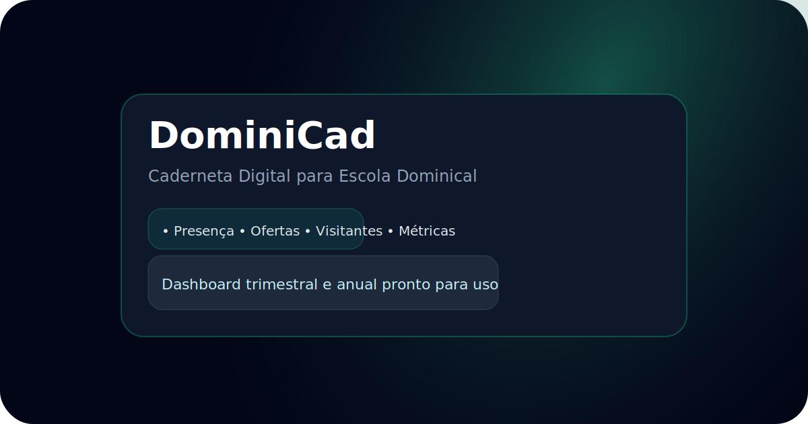

# DominiCad – Caderneta Digital SaaS

DominiCad é um aplicativo SaaS pensado para igrejas evangélicas digitalizarem a tradicional caderneta da Escola Dominical. O objetivo do projeto é oferecer uma base completa com landing page, telas internas, rotas de API e documentação para evoluir o produto rumo a produção.



> **Status**: interface navegável com caderneta completa, rotas de API conectadas ao Prisma ORM e migração inicial pronta para uso local com SQLite.

## ✨ Principais recursos

- Landing page institucional com chamada para cadastro, descrição de recursos e planos.
- Tela de autenticação com formulário unificado de login e registro.
- Dashboard com cartões de métricas, tabelas e gráficos em CSS para acompanhamento trimestral e anual.
- Caderneta digital que replica todas as seções da caderneta física (orientações, frequência trimestral, relatórios anuais e rol da classe).
- Rotas de API com Prisma ORM para usuários, turmas, alunos, presenças e métricas conectadas ao banco relacional.
- Design responsivo inspirado na caderneta física, com identidade moderna em tons de esmeralda e ardósia.

## 🧱 Arquitetura da solução

| Camada          | Tecnologia                     | Observações |
|-----------------|--------------------------------|-------------|
| Front-end       | Next.js 15 (App Router) + React 19 | Componentização com Tailwind CSS 4 (classes utilitárias) e fontes Geist. |
| Autenticação    | Integração planejada com Firebase/Auth0 | Rotas de login/registro prontos para emitir JWT futuramente. |
| Back-end / API  | Next.js Route Handlers + Prisma ORM | Endpoints conectados ao banco, com validação básica e isolamento por usuário. |
| Banco de dados  | SQLite (desenvolvimento) via Prisma | Migração inicial gera `dev.db`. Fácil adaptação para PostgreSQL ou Mongo via Prisma. |

### Modelagem de dados (Prisma)

```mermaid
erDiagram
    User {
      string id PK
      string email
      string passwordHash
      string churchName
      string teacherName
      string superintendent
      string plan
      datetime createdAt
    }
    Class {
      string id PK
      string userId FK
      string name
      int year
      int quarter
      string professorName
      string superintendent
      string churchName
    }
    Student {
      string id PK
      string classId FK
      int orderNumber
      string name
      int age
      datetime enrollmentDate
    }
    Attendance {
      string id PK
      string classId FK
      string studentId FK
      datetime date
      bool present
      bool broughtBible
      bool broughtLesson
      bool reviewedLesson
      decimal offeringValue
      int visitors
      string notes
    }
    PersonalReport {
      string id PK
      string studentId FK
      int year
      float attendanceScore
      float behaviorScore
      float punctuality
      float bibleKnowledge
      float finalScore
    }
    ClassReport {
      string id PK
      string classId FK
      int year
      int quarter
      int enrolled
      int presences
      int absences
      float percentPresent
      int visitors
      int totalAssistances
      int bibles
      decimal offerings
      float quarterlyGrade
      float annualClassGrade
    }

    User ||--o{ Class : possui
    Class ||--o{ Student : matricula
    Class ||--o{ Attendance : registra
    Student ||--o{ Attendance : participa
    Student ||--|| PersonalReport : avalia
    Class ||--o{ ClassReport : sintetiza
```

## 📂 Estrutura de pastas

```
src/
├── app/
│   ├── api/               # Rotas REST mockadas
│   ├── caderneta/         # Tela de registro semanal
│   ├── dashboard/         # Painel com métricas
│   ├── login/ e register/ # Fluxos de autenticação
│   └── page.tsx           # Landing page institucional
├── components/            # Componentes compartilhados
└── data/                  # Dados mockados para UI
```

## 🔐 Rotas de API disponíveis

| Método | Rota                        | Descrição |
|--------|-----------------------------|-----------|
| POST   | `/api/auth/register`        | Cria usuário no Prisma com hash de senha e retorna workspace. |
| POST   | `/api/auth/login`           | Valida credenciais e devolve token mockado + dados da igreja. |
| GET/POST | `/api/classes`            | Lista ou cria turmas isoladas por usuário. |
| GET/POST | `/api/students`           | CRUD de alunos por turma com dados completos. |
| GET/POST | `/api/attendances`        | Registra presença individual (upsert) e consolida totais. |
| GET    | `/api/dashboard`            | Consolida métricas da classe a partir das tabelas Prisma. |

> Para produção, substitua o token mockado por JWT e configure `DATABASE_URL` para o provedor relacional desejado.

## 🚀 Como executar localmente

```bash
cp .env.example .env
# ajuste DATABASE_URL conforme seu banco
npm install
# executar migração (requer internet para baixar os engines do Prisma)
DATABASE_URL="file:./prisma/dev.db" npx prisma migrate deploy
npm run dev
```

O servidor será iniciado em [`http://localhost:3000`](http://localhost:3000). Caso esteja sem acesso à internet e o download dos engines do Prisma falhe, crie o arquivo `prisma/dev.db` vazio para testar a interface offline.

## 🛠 Próximos passos sugeridos

- Conectar as rotas de API a um banco real (MongoDB Atlas ou Supabase/PostgreSQL).
- Implementar autenticação real com Firebase Auth ou Auth0, armazenando o `workspaceId` no token.
- Criar camada de serviço para cálculos avançados (média de frequência, indicadores por trimestre/ano).
- Integrar biblioteca de gráficos (ex.: Recharts) para visualizações dinâmicas.
- Implementar autorização por perfil (pastor, superintendente, professor, secretário).

## 📄 Licença

Projeto entregue como base educacional e pode ser adaptado livremente pela sua igreja ou equipe de desenvolvimento.
